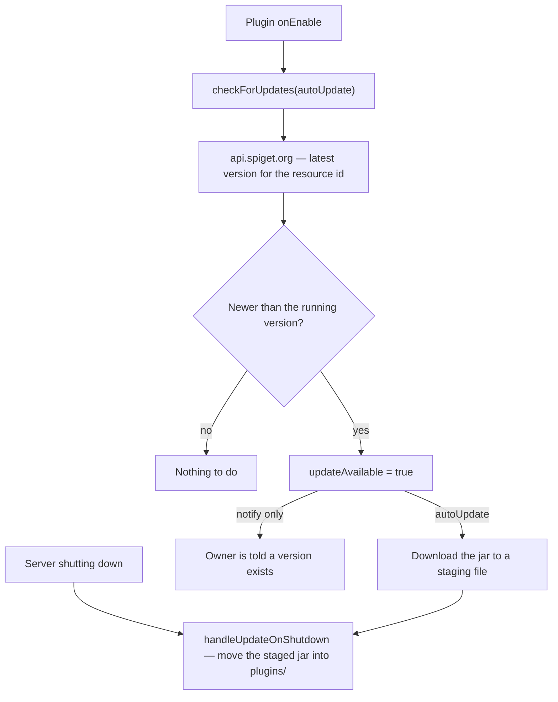

<h1 align="center">UpdaterAPI</h1>

<p align="center">
  <b>Update checker and auto-updater for Spigot plugins, backed by the Spiget API.</b>
</p>
<p align="center">
  Compares the running version against the resource's latest published version, downloads<br />
  the new jar when asked, and swaps it in at shutdown so the next restart comes up updated.
</p>

<p align="center">
  
  
  
  
  
</p>

<br />

## Why UpdaterAPI

A jar cannot overwrite itself while the server has it open, which is why most plugin updaters stop at telling an owner there is a new version and leave the rest to them. UpdaterAPI does the download while the server is running and performs the swap during shutdown, when the file is finally free — so the update lands without anyone visiting a download page, and it lands at the only moment a jar change is safe anyway.

<table width="100%">
  <tr>
    <td width="50%" valign="top">
      <h3 align="center">Swapped at shutdown</h3>
      <p align="center">The new jar is fetched while the server runs and moved into place as it stops, the one point where replacing a loaded plugin jar cannot break the running server.</p>
    </td>
    <td width="50%" valign="top">
      <h3 align="center">Numeric version compare</h3>
      <p align="center">Version names are stripped of non-numeric characters and compared segment by segment, so <code>v1.10</code> is correctly newer than <code>1.9</code> instead of sorting before it.</p>
    </td>
  </tr>
</table>

<br />

## Stack

| Layer | Technology |
| :--- | :--- |
| Language | Java 17 bytecode |
| Server API | spigot-api 1.21.4 |
| Version source | Spiget, the read-only SpigotMC resource API |
| Build | Maven with `maven-shade-plugin` |
| Bundled | Gson 2.10.1 |

## Requirements

- Paper or Spigot, Minecraft 1.21 through 26.2
- Java 17 or newer

## Getting started

```java
public class MyPlugin extends JavaPlugin {
    private UpdaterService updater;

    @Override
    public void onEnable() {
        updater = new UpdaterImpl(this, RESOURCE_ID);
        updater.checkForUpdates(true); // true also downloads the update
    }

    @Override
    public void onDisable() {
        updater.handleUpdateOnShutdown();
    }
}
```

`RESOURCE_ID` is the numeric id in the resource's spigotmc.org URL.

Install it to your local Maven repository, then depend on it:

```bash
mvn install
```

```xml
<dependency>
    <groupId>com.trenton</groupId>
    <artifactId>UpdaterAPI</artifactId>
    <version>1.0.0</version>
</dependency>
```

## API

| Call | Does |
| :--- | :--- |
| `checkForUpdates(boolean download)` | Compare against the latest published version, and fetch the new jar when `download` is true. |
| `isUpdateAvailable()` | Whether the last check found a newer version. |
| `getLatestVersion()` | The version name the last check reported, for join notifications and the like. |
| `handleUpdateOnShutdown()` | Move a downloaded jar into the plugins folder. Call from `onDisable`. |

`checkForUpdates` performs blocking network calls on the thread that invokes it — call it off the main thread, or accept the startup pause.

## Architecture



## How it works

- **The swap waits for shutdown because it has to.** A loaded jar cannot be overwritten while the server holds it open, so the download happens during normal running and the file move happens in `handleUpdateOnShutdown` — the one moment the file is free and a jar change cannot break anything still running.
- **Versions are compared numerically, not lexically.** Both version names are stripped of non-numeric characters and compared segment by segment, which is what makes `v1.10` correctly newer than `1.9` instead of sorting before it.
- **Two Spiget endpoints, one resource id.** The version check reads `/resources/{id}/versions/latest` and the download pulls `/resources/{id}/download`, so a plugin only ever configures the one number.
- **Auto-update is opt-in per call.** `checkForUpdates(false)` sets `isUpdateAvailable()` and `getLatestVersion()` and stops there, leaving the notification to the calling plugin.

## Project structure

```
updaterapi/
└── src/main/java/com/trenton/updater/
    └── api/UpdaterImpl.java     Spiget lookup, version compare, download, shutdown swap
```

## Building

```bash
mvn package
```

The shaded jar lands in `target/`.

## License

Copyright (c) 2026 Trenton Taylor. All rights reserved.

<br />

<p align="center">
  <sub>A jar cannot replace itself while it is loaded. So do it on the way out.</sub>
</p>
